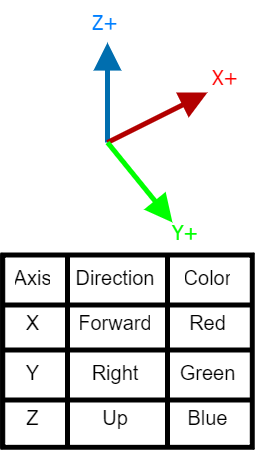

# Sensors setup

## Cameras

Cameras have been placed similar to the set of cameras used in the Tesla HW3. 
Also a BEV (Bird Eye View) segmentation camera has been placed above the car.

All the cameras use the Unreal coordinate system.

{width="25%"}

### Intrinsics matrix

The camera intrinsics matrix \( K \) is:

\[
K = \begin{bmatrix} 377.59 & 0 & 450 \\ 0 & 107.40 & 128 \\ 0 & 0 & 1 \end{bmatrix}
\]

where:
- \( f_x = 377.59 \): Focal length in the x-direction
- \( f_y = 107.40 \): Focal length in the y-direction
- \( c_x = 450 \): Principal point x-coordinate (center of the image)
- \( c_y = 128 \): Principal point y-coordinate (center of the image)
